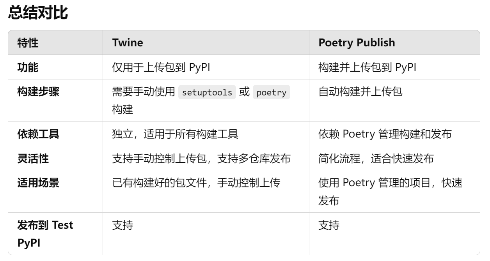
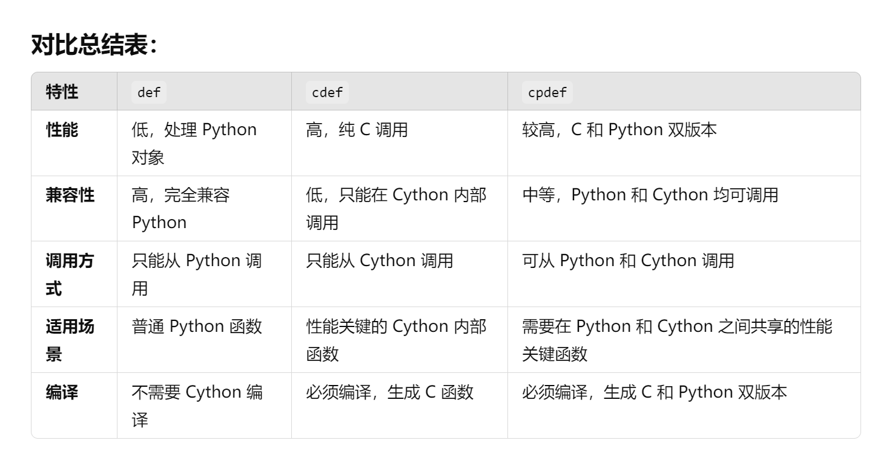
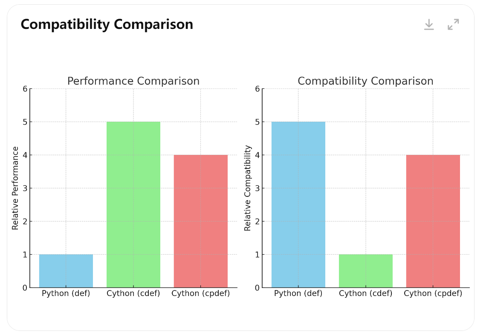

# MyFirstProject
a road to fortune

- [x] git & github
- [x] dependence
- [x] .gitignore
- [x] pytest
- [x] LICENSE
- [x] __init__.py
- [ ] CI/CD
- [x] setup.py & pyproject.toml
- [x] pre-commit
- [ ] docker
- [x] makefile
- [x] markdown
- [x] .pyc & Cython
- [x] 其他
  - [x] 建立新仓库
  - [x] fork与branch
## About Git & GitHub
1. git的安装可以绑定到vscode中，这样方便我们直接在vscode中进行git操作，并且vscode有许多方便的git插件。
2. 好用的插件：**GitLens**
3. 当我们使用`git clone`或者`git pull`可以得到一个*库*。用 **.git**文件夹（一般是隐藏的）来进行管理的本地版本控制。
4. 初次使用git命令会配置用户名和密码，按提示来就好。
5. 当我们需要将本地库与远程库（github）绑定的时候可以使用SSH
   1. SSH在安装git后自带，输入ssh-keygen -t rsa -C "your email"。
   2. 获得密钥，打开pub后缀文件，复制内容。
   3. 站到github里SSH的KEY里。
   4. 以后pull最好都用SSH。
   5. [教程链接（我上面写的更简洁）](https://www.cnblogs.com/olive27/p/6056612.html)
6. vscode里打开终端，可以在终端右上角更改使用powershell或者git bash。
7. 相关git操作
    ```python
    #常用git命令
    #克隆仓库：
    git clone <git地址>
    #初始化仓库：
    git init

    #添加文件到暂存区：
    git add .
    #把暂存区的文件提交到仓库：
    git commit -m "提交信息"
    #查看提交的历史记录：
    git log --stat

    #工作区回滚：
    git checkout <filename>
    #撤销最后一次提交：
    git reset HEAD^1

    #以当前分支为基础新建分支：
    git checkout -b <branchname>
    #列举所有的分支：
    git branch
    #单纯地切换到某个分支：
    git checkout <branchname>
    #删掉特定的分支：
    git branch -d <branchname>
    #合并分支：
    git merge <branchname>

    #推送当前分支最新的提交到远程：
    git push
    #拉取远程分支最新的提交到本地：
    git pull

    #推送到主分支（main 或 master）
    git push origin main
    #推送到其他分支
    git push origin feature-branch
    #推送本地分支到远程的新分支(没有已存在的就新建，-u提供绑定)
    git push -u origin my-local-branch
    git push -u origin my-local-branch:remote-branch-name
    ```
8. 大多数操作可以利用GitLens进行可视化操作。
9. > [B站教程](https://www.bilibili.com/video/BV1db4y1d79C/?spm_id_from=333.1007.top_right_bar_window_history.content.click&vd_source=cc0f1a739a49e6242d2584c6f680be01)

## Dependence
环境依赖可以自动生成，主要有四种方法：
1. requirements.txt
   1. 格式：TXT
   2. 生成: `pip freeze > requirements.txt`
   3. 安装：`pip install -r requirements.txt`
2. Pipfile
   1. 格式：TOML
   2. 生成: 当使用 Pipenv 安装依赖时，Pipfile 文件会自动生成，`pipenv install numpy pandas`
   3. 安装：`pipenv install`
3. environment.yml
   1. 格式：YAML
   2. 生成: `conda env export > environment.yml`
   3. 安装：`conda env create -f environment.yml`
4. pyproject.toml
   1. 格式：TOML
   2. 生成: 当使用 Poetry 安装依赖时，pyproject.toml 文件会自动生成，`poetry add numpy pandas`
   3. 安装：`poetry install`

- **相对于*requirement.txt*，*environment.yml*可以包含conda和pip安装的，但前者只能查找出pip安装的。**

## .gitignore
- github可以自动生成模板

## Pytest
- pytest
  - 测试目标：
    - 单元测试：用于确保代码的基础功能是正确的。
    - 集成测试：用于验证模块之间的交互。
    - 端到端测试：用于模拟真实用户操作。
    - 回归测试：确保代码修改不会引入新问题。
  - 命名规则：
    - pytest 默认会自动查找以下命名规则的**文件**：
      - 文件名以 test_ 开头，例如 test_example.py。
      - 文件名以 _test.py 结尾，例如 example_test.py。
    - pytest 会自动发现并运行以下命名规则的**函数**：
      - 函数名以 test_ 开头，例如 def test_addition():。
    - pytest 会自动发现并运行以下命名规则的**类与方法**：
      - **类**名必须以 Test 开头。例如，class TestMyFunctions 是一个有效的测试类名称。
      - 类中的测试**方法**必须以 test_ 开头。例如，def test_addition(self): 会被自动识别为一个测试方法。
    - 文件名符合，函数或者类的命名不符合也不会执行
  - **@pytest.fixture 装饰器**：用于定义夹具，用于准备和清理测试所需的资源。只有需要提供特殊功能（如资源准备或清理）的函数才需要使用这个装饰器。普通的测试函数不需要这个装饰器。
- report of pytest
  - 自动生成测试报告，pytest-testreport，pytest-html，allure-pytest。以下使用pytest-testreport（和html包会起冲突）；allure需要下载软件。
  - pytest.ini和setup.cfg，以上两种方式可以为pytest配置一些初始化参数，规整后续可能用到pytest时（如CI/CD）的格式。
- `pytest --report=report.html --title=测试报告 --tester=Brando --desc=FirstProject  --template=2`
- 代码覆盖率：可以通过`pip install pytest pytest-cov`安装集成式覆盖率测试。他的功能主要是测试模块、代码行是不是都有被执行过。可以通过`pytest --cov=my_module --cov-report=html`生成html式报告。注意my_module最好是一个文件夹，命令会自动收集里面的.py文件，并查找**函数和类**进行测试（前提是pytest的目标文件调用过这些模块）。*特别的*，覆盖率计算的方式是整体代码文件，即如果有些顶层的代码未封装，我们很难对其进行测试，但是计算覆盖率的时候他们会被计算进**未覆盖。**


## LICENSE
- MIT和APACHE都是都是比较宽松的协议

## pre-commit
Pre-commit 是一个用于管理和运行 Git hooks 的工具，Git hooks 是在特定的 Git 操作（如 commit、push 等）时自动执行的脚本。Pre-commit 可以确保在代码提交前执行特定的代码检查、格式化或验证操作，从而提高代码质量并确保团队协作中遵守一致的代码规范。  

- Pre-commit 的作用：
  - 自动运行代码质量检查，如代码格式、静态分析、语法检查等。
  - 防止不符合规范的代码被提交。
  - 在提交之前自动修复代码（如自动格式化）。
  - 可以整合多个检查工具，自动执行一系列代码质量保障任务。
- 步骤
  - 安装`pip install pre-commit`
  - 配置 .pre-commit-config.yaml 文件。`pre-commit sample-config > .pre-commit-config.yaml`
  当然也可以找模板
    - 模板更新`pre-commit autoupdate`
  - 安装 pre-commit 钩子`pre-commit install`
  - 运行 pre-commit
    - git commit时会自动触发
    - 也可以手动运行`pre-commit run --all-files`
- 与Makefile的不同
  - 整体来说主要是执行的时间点不同，并且makefile除了检查也可以用来构建，功能更全面一点
## Makefile
### 简单的说就是一套自动化工具。它不专门针对 Python 项目，而是通用的自动化工具，可以用在任何类型的项目中，包括 Python、C++、JavaScript 等。它通常用于简化日常的开发操作，如安装依赖、运行测试、清理临时文件等。
- 由于Python 是解释型语言，代码不需要编译成可执行文件。Makefile 在 Python 项目中的作用通常是为了自动化常见的开发任务，比如创建虚拟环境、安装依赖、运行测试、格式化代码等。Makefile 更多的是起到简化项目管理和开发者任务的作用。
- 任务： 你可以在 Makefile 中定义任何你想自动化的操作。比如：
  - 创建虚拟环境
  - 安装依赖
  - 运行测试
  - 启动应用
- 灵活性：Makefile 可以集成不同的工具和命令，包括调用 setup.py 来安装依赖，或者使用其他工具（如 pipenv、poetry）管理 Python 环境。
- **特别的：**
  - 往往对于*python*项目，我们会直接手动编写Makefile，因为过程往往比较简单。但是对于比如C++语言，写Makefile会比较麻烦，于是我们会用CMake。在此之前，我们需要学习一些相关的基础知识。
- **相关概念：**
  - 在 C++ 项目中，Makefile 通常用于**自动化编译、链接、清理**等过程。C++ 是编译型语言，源代码需要经过编译器编译为目标文件，然后链接为可执行文件。Makefile 管理这个过程中的依赖关系，并确保源文件发生更改时，能够正确编译和链接。
  - **GCC(GNU Compiler Collection)：** 可以简单理解为**编译器**，他可以编译多种语言。当有*一个源文件*的时候我们可以直接使用gcc编译它。但是如果有*多个源文件*的时候呢？
  - **make：** make工具可以理解为一个只能批处理工具，他本身并没有编译和链接功能。他像是一个指挥家，指挥乐谱，也就是makefile文件。
  - **makefile：** 这里我们提到makefile主要是他在编译和链接方面的作用。这里makefile命令中就包含了调用*gcc*去编译某个源文件的命令。
  - **CMake：** 对于简单项目（或者python项目，不涉及编译）我们可以手写makefile，但是对于大型项目而言，这个过程会变得非常复杂。所以我们可以使用CMake来自动生成makefile，并且他更强的功能在于可以跨平台（例如Windows和Linux）生成对应平台能用的makefile。
  - **CMakeLists.txt:** CMake在生成makefile的时候也需要一个准则，他就是CMakeLists.txt。这个文件也需要我们自己手写。
- **相关链接：**
  - [相关概念介绍](https://www.bilibili.com/video/BV1Uu4y1P78k/?spm_id_from=333.337.search-card.all.click&vd_source=cc0f1a739a49e6242d2584c6f680be01)
  - [CMake](https://www.bilibili.com/video/BV1bg411p7oS/?spm_id_from=333.788.recommend_more_video.0&vd_source=cc0f1a739a49e6242d2584c6f680be01)
  - [makefile入门](https://www.bilibili.com/video/BV1tyWWeeEpp/?spm_id_from=333.788.recommend_more_video.1&vd_source=cc0f1a739a49e6242d2584c6f680be01)
  - [makefile入门2](https://www.bilibili.com/video/BV188411L7d2/?spm_id_from=333.337.search-card.all.click&vd_source=cc0f1a739a49e6242d2584c6f680be01)
- **书写注意事项：**
  - Makefile 是一种特殊的文本文件，定义了执行任务的规则和命令。它没有特定的扩展名（文件名就是 Makefile），并且每个任务（或规则）由目标名称、依赖项和执行命令组成。
  - 执行命令必须以 Tab 缩进。（**这意味着：** 目标名（如 lint: 和 test:）的下一行是命令，该行开头必须使用一个 Tab。
Tab 缩进只用于每一行命令的开头，并不是命令中的参数之间用 Tab 隔开。）
  - 依赖项可以直接写一行，如：all: format lint test success
  - 执行全部直接用`make`(他的前提是将全部任务整合成一个新的任务，并放在第一个，因为`make`默认执行第一条。),执行特定任务使用`make <task_name>`。
  - `.PHONY: test`这种语法可以规避一些冲突风险，比如我有一个test命令，但同时我也有一个test的文件存在，这个时候就会出现冲突了。这时候.PHONY就可以规避掉这个问题。这个可以写在第一行，make依然会自动执行第一个命令。
  - makefile种的一些格式化工具，会有默认的参数，**但当你又一些特殊文件时，他们会查找这些文件里的参数**，例如：black会找pyproject.toml、flake8会这setup
  - 过长折行用\;# noqa: F401可以忽略空导入
## \_\_init__.py
- 在老版本python里，\_\_init__.py是作为一个标志，声明python文件夹为一个包，内容是空的就可以。
- 但是为什么新版还在用呢？一方面是为了兼容性，另一方面是为了导出使用更加的方便。详情可以看顶层的python_framework_template和math_toolkits的\_\_init__.py文件。他们通过init的初始化，让main.py可以直接`from python_framework_template import add_numbers`。减少了导入复杂度。
- 可以写一些初始设置，方便测试。

## setup.py & pyproject.toml
就现在而言，pyproject.toml以及逐渐替代setup.py，他有更清晰的格式，同时也可以管理发布PyPI的配置。  
Poetry 是一个非常流行的 Python 依赖管理和打包工具，它能够自动生成 pyproject.toml 文件，并简化项目的创建、依赖管理、打包和发布流程。  
1. 安装。
   1. `pip install poetry`
2. 配置
   1. 对于全新项目
      1. `poetry new your_project_name`
   2. 对于已有项目
      1. `poetry init`
3. 关于依赖(可选)
   1. 可以不绑定依赖（我喜欢分开管理）
      1. 对于已有环境配置文件：`poetry add $(cat requirements.txt)`
      2. 对于单独的依赖：`poetry add <package_name>`
4. 构建项目
   1. `poetry build`
   2. 会同时生成sdist，wheel包
      1. sdist：原始代码包，适合需要编译的项目。
      2. wheel:编译后的二进制包，适合无需编译即可安装的项目。
   3. 这里需要注意的是，需要打包的字段需要通过packages编辑。简单来说，Poetry 能够自动识别包的前提是代码包名和 pyproject.toml 中的 name 字段一致，并且代码包位于项目根目录下或符合 Poetry 的默认项目结构约定。但如果name字段与需要打包的文件不同或者有多个需要打包的文件夹，则需要packages字段。  `# 指定多个包及其路径
    packages = [
        { include = "mypackage1", from = "src/core/subpackage1" },
        { include = "mypackage2", from = "src/core/subpackage2" }
    ] `
5. 发布到 PyPI
   1. poetry publish流
      1. `poetry publish --build`此命令会重新build
      2. `poetry publish --build --repository testpypi`测试服
   2. twine流 
      1. `pip install twine`
      2. `twine upload dist/*`
      3. `twine upload --repository-url https://test.pypi.org/legacy/ dist/*`
6. 验证发布
   1. 正式：`pip install your_project_name`
   2. 测试：`pip install --index-url https://test.pypi.org/simple/ your_project_name
`  

poetry publish与twine的差别：


## Markdown 
<details>
<summary>展开查看Markdown使用，对照原md文件查看</summary>

# Markdown
## BrandoBa
### Markdown all in one
### github style preview
---
## 快捷键
**ctrl+b**  
*ctrl+I*
# ctrl+shift+]
# ctrl+shift 组合[ or ]来输入输出#
$ctrl+M$输出单行公式
$$
ctrl+ M M输出模式块 
$$
~~Alt+s~~

Test
一个Enter
---
Test

两个Enter
***
Test  
两个空格一个Enter

>这是一个引用
echo 'export PATH="~/anaconda3/bin:$PATH"' >> ~/.bashrc
echo 'source ~/anaconda3/bin/activate' >> ~/.bashrc
source ~/.bashrc  
>
>下一段引用  
>>引用中的引用
>- 也可以加入其他

## 分割
***斜线加粗***
+ 加号列表
+ 1
  
    缩进一个Tab

+ 3

* 星号列表
  
    >块

* end
- 减号列表
  - 内部
    - 再内部
- 不同符号可以分组无序列表
- zheshishenme 
- [OpenAI](https://www.openai.com "一个开源团队")
- 
- <https://123.com>
- [](123)

一级
===
二级
---

    代码块
        可以
            直接用缩进
    end         

```
也可以用~
```
```python
print("这种三点式围栏可以附加语言种类")
```
&copy;

4 < 5

This is a regular paragraph.

<table>
    <tr>
        <td>Foo</td>
    </tr>
</table>

This is another regular paragraph.

| name | Age |Sex|
|---|:------:|---|
| bb   | 27  |male|

Here's a simple footnote[^1] and here's a longer one.[^bignote]

[^1]: www.baidu.com
- [ ] 任务列表
- [x] Alt+C 可以快捷check X
  - [ ] 子任务

目录链接
- [开始位置](#markdown)
  - [二级](#分割)

</details>

## .pyc & Cython
- .pyc
  - 什么是 .pyc 文件？
    - .pyc 文件是 Python 源代码（.py 文件）编译后的字节码文件。当你运行一个 Python 程序时，解释器会将 .py 文件编译成字节码，并将其存储在 .pyc 文件中。这有助于加快程序的启动速度，因为下次运行时可以直接加载字节码而无需重新编译。
  - .pyc 文件的作用
    - 加快加载速度：避免每次运行程序时都重新编译源代码。
    - 代码保护：虽然 .pyc 文件不是完全的保护措施，但相比 .py 文件，源码不易被直接查看。
  - 如何生成 .pyc 文件？
    - 自动生成在__pycache__ 目录下
  - 独立性
    - pyc可以脱离源码执行，但是对编译环境和依赖要求敏感
- Cython
  - 什么是 Cython？
    - Cython 是一种编程语言，它是 Python 的超集，允许你编写类似 Python 的代码，并将其编译为 C 或 C++ 代码，从而大幅提升代码的执行速度。Cython 特别适用于需要高性能计算的场景，如数值计算、图像处理等。
  - 为什么使用 Cython？
    - 性能提升：通过编译为 C 代码，Cython 可以显著加快代码执行速度，特别是在循环和数学计算密集的部分。
    - 与 C/C++ 集成：Cython 允许你方便地调用 C/C++ 库，扩展 Python 的功能。
    - 静态类型声明：通过在代码中声明变量类型，进一步优化性能。
    - 优化方案需要详细学习，一般是变量
- Cython安装与使用
  - `pip install cython`
  - 编写.pyx
  - 编写辅助编译的py文件
  - 编译文件`python setup.py build_ext --inplace`
  - 编译之后会生成pyd或者so可以用来调用
- 一些细节与对比
  - 
  - 

## 其他
### 建立新仓库
1. **git clone**
   1. 先在github上建立仓库
   2. 本地clone，如果配置过SSH，最好使用SSH
2. 本地创建仓库后再推送到GitHub
   1. 先在github上建立仓库
   2. `git init`
   3. `git add .`  
      `git commit -m "Initial commit"`   
   4. `git remote add origin https://github.com/yourusername/my-local-project.git`
   5. `git push -u origin master`
3. 在GitHub上fork（派生）一个现有的项目并克隆
   1. fork别人的项目到自己的仓库
   2. 然后`git clone`
4. 创建一个裸仓库
   1. 通常是作为自己的服务器用，详情再查
### fork&branch
Fork 和 Branch 是 Git 和 GitHub 中常见的操作，它们都涉及代码版本管理，但用途和操作方式不同。下面是它们的区别：  
- **Fork 和 Branch 的差异总结**：
  - Fork：
    - 在 GitHub 级别，复制整个项目到你自己的账户下。
    - 用于基于他人项目开发，适合贡献开源项目。
    - 独立于原始项目，不同仓库之间没有自动同步。
  - Branch：
    - 在同一个仓库内部创建并行开发线。
    - 用于同一项目的不同任务或功能开发。
    - 分支之间可以轻松合并，并且共享相同的提交历史。
- **场景对比**：
  - 如果你想对一个开源项目进行修改，并可能向原项目提交更改，你会 fork 该项目，然后在你自己账户下的副本中工作。
  - 如果你在自己项目中开发新功能或修复 bug，你会 branch 主分支以便进行并行开发。